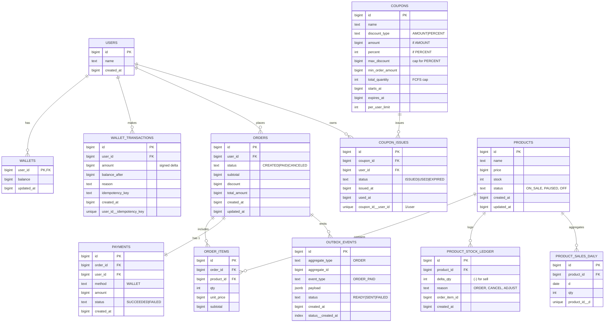

# ERD

> **재고/쿠폰 경쟁 환경에서의 정합성**과 **결제/이벤트 발행의 원자성** 을 보장합니다.

## 정합성 전략
- **재고 차감**: 원자성으로 재고를 차감하고 `PRODUCT_STOCK_LEDGER` 기록합니다.
- **쿠폰 발급(FCFS)**: Redis `DECR` + 사용자 중복 체크(`%% UNIQUE(coupon_id, user_id)
      unique coupon_id__user_id`) 및 Lua 스크립트로 원자화합니다.
- **결제/주문**: 단일 DB 트랜잭션(모놀리식)으로 주문/결제/쿠폰사용/재고차감을 우선 구현합니다. 분리 시 SAGA + 보상 사용합니다.
- **이벤트 발행**: Outbox 테이블에 기록 후 전용 워커가 Kafka/HTTP로 전송(최소 1회 보장, 멱등 처리).
- **상위상품 집계**: `ORDER_ITEMS` 스트림을 일자별로 roll-up → `PRODUCT_SALES_DAILY`에 upsert. 조회 시 최근 3일 합계합니다.
