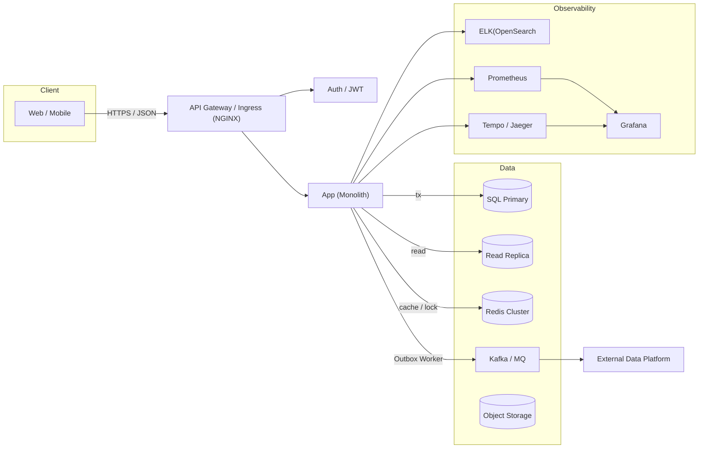

## 인프라 구성도 & 컴포넌트 설명

## 컴포넌트
- **API Gateway / Ingress**: TLS 종료, 라우팅
- **App (Monolith)**: Spring Boot 모놀리식. 모듈: `catalog`, `inventory`, `order`, `payment`, `coupon`, `top-products`, `outbox`.
- **SQL Primary / Read Replica**: 쓰기=Primary, 읽기=Replica. Read-your-writes 필요한 경우 Primary로 강제합니다.
- **Redis Cluster**: 선착순 쿠폰 카운터, 분산락, 단기 캐시, Idempotency-Key 저장
- **Kafka / MQ**: Outbox 워커가 `ORDER_PAID` 등 이벤트 송신(최소 1회, 멱등 소비 설계)
- **Object Storage**: 상품 이미지 등 정적 리소스 저장
- **Observability**: ELK(OpenSearch) / Prometheus / Grafana 등

### 신뢰성 보장
- **재시도**: 5xx 및 네트워크 오류만 지수백오프로 재시도합니다. DB 커밋 이후 외부 송신은 Outbox로 멱등 처리합니다.
- **락 전략**: 쿠폰 FCFS는 Redis `DECR`
- **데이터 정합성**: 추후 SAGA 보상(환불, 쿠폰상태/재고 롤백 등) 추가합니다.
- **캐시 일관성**: 쓰기 후 캐시 무효화 + 짧은 TTL.
